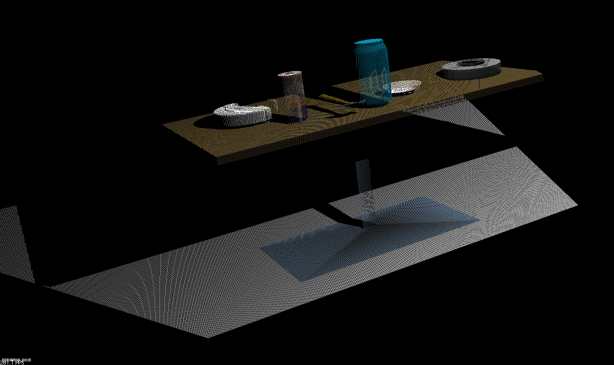
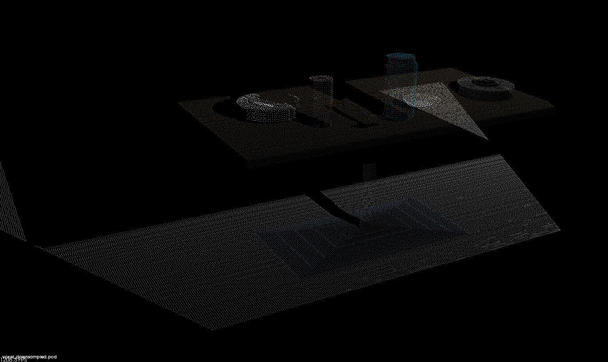
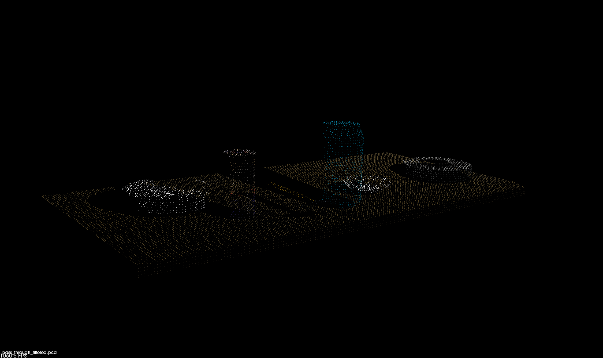
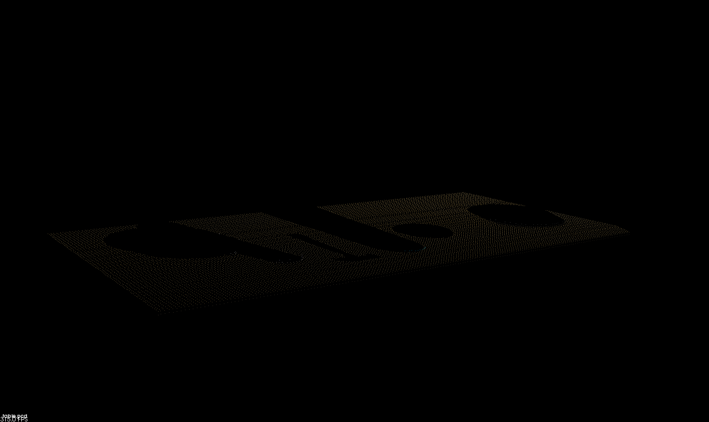
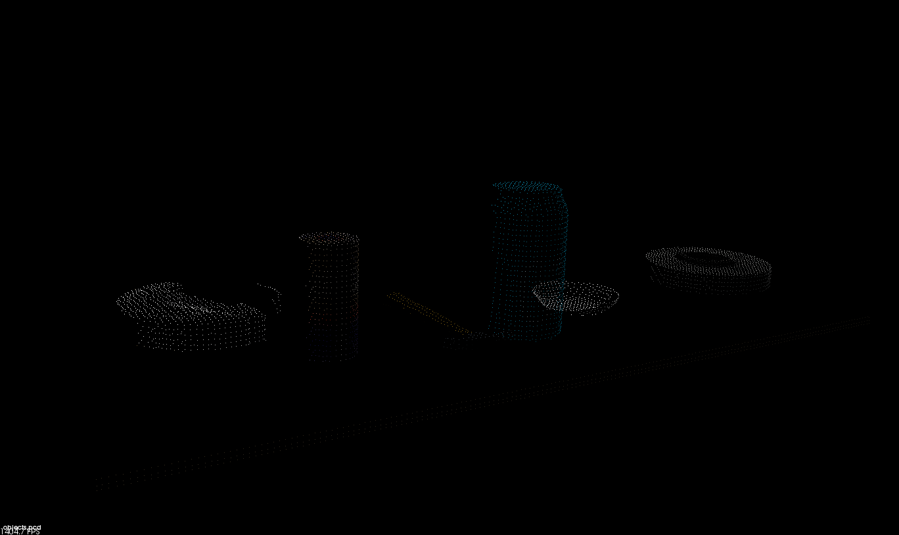
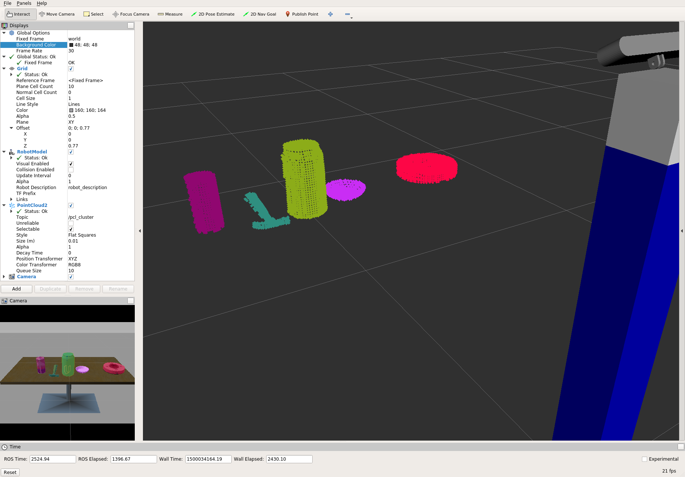
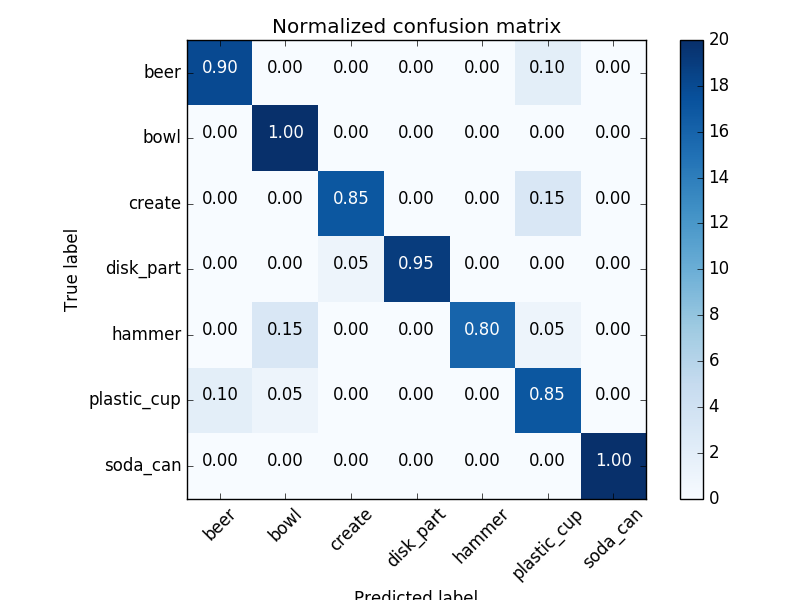
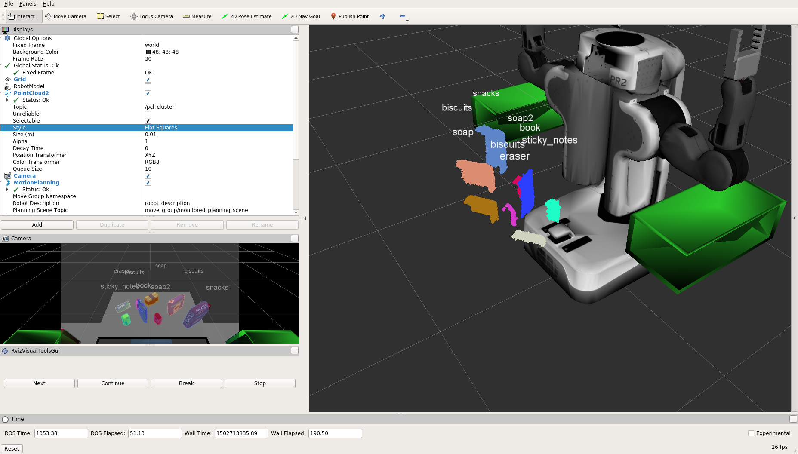

## Project: Perception Pick & Place

---


# Required Steps for a Passing Submission:
1. Extract features and train an SVM model on new objects (see `pick_list_*.yaml` in `/pr2_robot/config/` for the list of models you'll be trying to identify). 
2. Write a ROS node and subscribe to `/pr2/world/points` topic. This topic contains noisy point cloud data that you must work with.
3. Use filtering and RANSAC plane fitting to isolate the objects of interest from the rest of the scene.
4. Apply Euclidean clustering to create separate clusters for individual items.
5. Perform object recognition on these objects and assign them labels (markers in RViz).
6. Calculate the centroid (average in x, y and z) of the set of points belonging to that each object.
7. Create ROS messages containing the details of each object (name, pick_pose, etc.) and write these messages out to `.yaml` files, one for each of the 3 scenarios (`test1-3.world` in `/pr2_robot/worlds/`).  See the example `output.yaml` for details on what the output should look like.  
8. Submit a link to your GitHub repo for the project or the Python code for your perception pipeline and your output `.yaml` files (3 `.yaml` files, one for each test world).  You must have correctly identified 100% of objects from `pick_list_1.yaml` for `test1.world`, 80% of items from `pick_list_2.yaml` for `test2.world` and 75% of items from `pick_list_3.yaml` in `test3.world`.
9. Congratulations!  Your Done!

# Extra Challenges: Complete the Pick & Place
7. To create a collision map, publish a point cloud to the `/pr2/3d_map/points` topic and make sure you change the `point_cloud_topic` to `/pr2/3d_map/points` in `sensors.yaml` in the `/pr2_robot/config/` directory. This topic is read by Moveit!, which uses this point cloud input to generate a collision map, allowing the robot to plan its trajectory.  Keep in mind that later when you go to pick up an object, you must first remove it from this point cloud so it is removed from the collision map!
8. Rotate the robot to generate collision map of table sides. This can be accomplished by publishing joint angle value(in radians) to `/pr2/world_joint_controller/command`
9. Rotate the robot back to its original state.
10. Create a ROS Client for the “pick_place_routine” rosservice.  In the required steps above, you already created the messages you need to use this service. Checkout the [PickPlace.srv](https://github.com/udacity/RoboND-Perception-Project/tree/master/pr2_robot/srv) file to find out what arguments you must pass to this service.
11. If everything was done correctly, when you pass the appropriate messages to the `pick_place_routine` service, the selected arm will perform pick and place operation and display trajectory in the RViz window
12. Place all the objects from your pick list in their respective dropoff box and you have completed the challenge!
13. Looking for a bigger challenge?  Load up the `challenge.world` scenario and see if you can get your perception pipeline working there!

## [Rubric](https://review.udacity.com/#!/rubrics/1067/view) Points
### Here I will consider the rubric points individually and describe how I addressed each point in my implementation.  

---
### Writeup / README

#### 1. Provide a Writeup / README that includes all the rubric points and how you addressed each one.  You can submit your writeup as markdown or pdf.  

This is the Writeup for Perception Pick & Place Project.

### Exercise 1, 2 and 3 pipeline implemented
#### 1. Complete Exercise 1 steps. Pipeline for filtering and RANSAC plane fitting implemented.

In this exercise 1, I have applied various filters to simulated point cloud data, and performed RANSAC segmentation to isolate objects in the scene.
The simulated tabletop scene is shown below.




The first filter I have applied is Voxel Grid Filter, which downsample input poind cloud data by taking a spatial average of the points confined by each voxel. I adjust the sampling size for a good job of representing the input point cloud as a whole by setting the voxel size along each dimension, LEAF_SIZE. Actual code and result image are shown below:

```python
### Voxel Grid filter
vox = cloud.make_voxel_grid_filter()
LEAF_SIZE = 0.01
vox.set_leaf_size(LEAF_SIZE, LEAF_SIZE, LEAF_SIZE)
cloud_filtered = vox.filter()
```



The second filter is Pass Through Filter, which remove useless data from input point cloud. I crop region of interest by specifying an axis with cut-off values along that axis because I have prior information about the location. Actual code and result image are shown below:

```python
### PassThrough filter
passthrough = cloud_filtered.make_passthrough_filter()
filter_axis = 'z'
passthrough.set_filter_field_name (filter_axis)
axis_min = 0.6
axis_max = 1.1
passthrough.set_filter_limits (axis_min, axis_max)
cloud_filtered = passthrough.filter()
```



After some filtering technique, I use RANSAC plane segmentation to remove the table itself from the scene. In this case, the model used is plane because I know the table can be expressed as plane shape. After that, I extract outlier points as objects because inlier points should be the table by applying this technique. Actual code and result images are shown below:
```python
### RANSAC plane segmentation
seg = cloud_filtered.make_segmenter()
seg.set_model_type(pcl.SACMODEL_PLANE)
seg.set_method_type(pcl.SAC_RANSAC)
# Max distance for a point to be considered fitting the model
max_distance = 0.01
seg.set_distance_threshold(max_distance)
inliers, coefficients = seg.segment()
extracted_inliers = cloud_filtered.extract(inliers, negative=False)
extracted_outliers = cloud_filtered.extract(inliers, negative=True)

### Save pcd for tabletop objects
pcl.save(extracted_inliers, 'table.pcd')
pcl.save(extracted_outliers, 'objects.pcd')
```






#### 2. Complete Exercise 2 steps: Pipeline including clustering for segmentation implemented.  

In this execise 2, I have built my perception pipeline in ROS, and added steps for cluster segmentation.

First of all, I created a ROS node that subscribes to point cloud topic, and publishes perception results like below. 
```python
if __name__ == '__main__':

    # ROS node initialization
    rospy.init_node('clustering', anonymous=True)

    # Create Subscribers
    pcl_sub = rospy.Subscriber("/sensor_stick/point_cloud", pc2.PointCloud2, pcl_callback, queue_size=1)

    # Create Publishers
    pcl_objects_pub = rospy.Publisher("/pcl_objects", PointCloud2, queue_size=1)
    pcl_table_pub   = rospy.Publisher("/pcl_table",   PointCloud2, queue_size=1)
    pcl_cluster_pub = rospy.Publisher("/pcl_cluster", PointCloud2, queue_size=1)

    # Initialize color_list
    get_color_list.color_list = []

    # Spin while node is not shutdown
    while not rospy.is_shutdown():
        rospy.spin()
```

In the callback function, `pcl_callback()`, I added the codes for exercise 1 and clustering codes. I used Euclidean Clustering algorithm to segment the points into individual objects. Actual code and result image are shown below.

```python
# Euclidean Clustering
white_cloud = XYZRGB_to_XYZ(extracted_outliers)
tree = white_cloud.make_kdtree()
# Create a cluster extraction object
ec = white_cloud.make_EuclideanClusterExtraction()
# Set tolerances for distance threshold 
# as well as minimum and maximum cluster size (in points)
ec.set_ClusterTolerance(0.05)
ec.set_MinClusterSize(1)
ec.set_MaxClusterSize(5000)
# Search the k-d tree for clusters
ec.set_SearchMethod(tree)
# Extract indices for each of the discovered clusters
cluster_indices = ec.Extract()

# Create Cluster-Mask Point Cloud to visualize each cluster separately
#Assign a color corresponding to each segmented object in scene
cluster_color = get_color_list(len(cluster_indices))

color_cluster_point_list = []

for j, indices in enumerate(cluster_indices):
    for i, indice in enumerate(indices):
        color_cluster_point_list.append([white_cloud[indice][0],
                                        white_cloud[indice][1],
                                        white_cloud[indice][2],
                                            rgb_to_float(cluster_color[j])])

#Create new cloud containing all clusters, each with unique color
cluster_cloud = pcl.PointCloud_PointXYZRGB()
cluster_cloud.from_list(color_cluster_point_list)

# Convert PCL data to ROS messages
ros_cluster_cloud = pcl_to_ros(cluster_cloud)

# Publish ROS messages
pcl_cluster_pub.publish(ros_cluster_cloud)
```




#### 3. Complete Exercise 3 Steps.  Features extracted and SVM trained.  Object recognition implemented.

In excercise 3, goal is to train an SVM to recognize specific objects in the scene. I have accomplished this by extracting a training set of features and labels, then training my SVM classifier, and finally using the classifier to predict what objects are in my segmented point cloud.

I have updated `compute_color_histograms()` and `compute_normal_histograms()` functions in `features.py` to extract a training set of features and labels like below. 

```python
def compute_color_histograms(cloud, using_hsv=False):

    # Compute histograms for the clusters
    point_colors_list = []

    # Step through each point in the point cloud
    for point in pc2.read_points(cloud, skip_nans=True):
        rgb_list = float_to_rgb(point[3])
        if using_hsv:
            point_colors_list.append(rgb_to_hsv(rgb_list) * 255)
        else:
            point_colors_list.append(rgb_list)

    # Populate lists with color values
    channel_1_vals = []
    channel_2_vals = []
    channel_3_vals = []

    for color in point_colors_list:
        channel_1_vals.append(color[0])
        channel_2_vals.append(color[1])
        channel_3_vals.append(color[2])
    
    # Compute histograms
    nbins=32
    bins_range=(0, 256)
    ch1_hist = np.histogram(channel_1_vals, bins=nbins, range=bins_range)
    ch2_hist = np.histogram(channel_2_vals, bins=nbins, range=bins_range)
    ch3_hist = np.histogram(channel_3_vals, bins=nbins, range=bins_range)

    # Concatenate and normalize the histograms
    hist_features = np.concatenate((ch1_hist[0], ch2_hist[0], ch3_hist[0])).astype(np.float64)
    normed_features = hist_features / np.sum(hist_features)

    return normed_features 


def compute_normal_histograms(normal_cloud):
    norm_x_vals = []
    norm_y_vals = []
    norm_z_vals = []

    for norm_component in pc2.read_points(normal_cloud,
                                          field_names = ('normal_x', 'normal_y', 'normal_z'),
                                          skip_nans=True):
        norm_x_vals.append(norm_component[0])
        norm_y_vals.append(norm_component[1])
        norm_z_vals.append(norm_component[2])

    # Compute histograms of normal values (just like with color)
    nbins=32
    bins_range=(-1.0, 1.0)
    norm_x_hist = np.histogram(norm_x_vals, bins=nbins, range=bins_range)
    norm_y_hist = np.histogram(norm_y_vals, bins=nbins, range=bins_range)
    norm_z_hist = np.histogram(norm_z_vals, bins=nbins, range=bins_range)

    # Concatenate and normalize the histograms
    hist_features = np.concatenate((norm_x_hist[0], norm_y_hist[0], norm_z_hist[0])).astype(np.float64)
    normed_features = hist_features / np.sum(hist_features)

    return normed_features
```

After that, SVM has been trained using `train_svm.py`. My normalized confusion matrix is shown below.




Then, object recognition steps have been implemented in the `pcl_callback()` function like below.
```python
    # Classify the clusters! (loop through each detected cluster one at a time)
    detected_objects_labels = []
    detected_objects = []

    for index, pts_list in enumerate(cluster_indices):
        # Grab the points for the cluster
        pcl_cluster = extracted_outliers.extract(pts_list)

        # Compute the associated feature vector
        # convert the cluster from pcl to ROS using helper function
        ros_cluster = pcl_to_ros(pcl_cluster)
        
        # Extract histogram features
        chists = compute_color_histograms(ros_cluster, using_hsv=True)
        normals = get_normals(ros_cluster)
        nhists = compute_normal_histograms(normals)
        feature = np.concatenate((chists, nhists))

        # Make the prediction, retrieve the label for the result
        # and add it to detected_objects_labels list
        prediction = clf.predict(scaler.transform(feature.reshape(1,-1)))
        label = encoder.inverse_transform(prediction)[0]
        detected_objects_labels.append(label)

        # Publish a label into RViz
        label_pos = list(white_cloud[pts_list[0]])
        label_pos[2] += .4
        object_markers_pub.publish(make_label(label,label_pos, index))

        # Add the detected object to the list of detected objects.
        do = DetectedObject()
        do.label = label
        do.cloud = ros_cluster
        detected_objects.append(do)

    rospy.loginfo('Detected {} objects: {}'.format(len(detected_objects_labels), detected_objects_labels))

    # Publish the list of detected objects
    detected_objects_pub.publish(detected_objects)
```


### Pick and Place Setup

#### 1. For all three tabletop setups (`test*.world`), perform object recognition, then read in respective pick list (`pick_list_*.yaml`). Next construct the messages that would comprise a valid `PickPlace` request output them to `.yaml` format.

In this project, I have implemented a perception pipeline using my work from Exercises 1, 2 and 3 to identify target objects from a so-called “Pick-List” in a particular order, pick up those objects and place them in corresponding dropboxes using PR2.

#### Filtering
I have added Statistical Outlier Filter to remove noise from previous work because this new dataset contains noise. Other filters, table segmentation and clustering method is same as previous work except some parameters based on the new environment and tabletop setups.

#### Recognition
I have increased the number of training model generation to 200 for each object for a larger set of random orientations of objects, and tried SVM parameter modifications (kernel, regularization etc.). However, `linear` kernel eventually gets best results in actual world scenes. Although `rbf` model fits well with the training dataset, poor recognition results were achieved in actual scene. I think that it might be due to overfitting. Then, I have tried parameter tuning, however good results cannot be provided. The accuracy results of parameter tuning for the training dataset are shown below. Finally, I chose the last one, kernel=`linear` and C=1000.

```
0.249 (+/- 0.007) for {'kernel': 'rbf', 'C': 1, 'gamma': 0.1}
0.940 (+/- 0.006) for {'kernel': 'rbf', 'C': 1, 'gamma': 0.01}
0.923 (+/- 0.006) for {'kernel': 'rbf', 'C': 1, 'gamma': 0.001}
0.842 (+/- 0.010) for {'kernel': 'rbf', 'C': 1, 'gamma': 0.0001}
0.282 (+/- 0.009) for {'kernel': 'rbf', 'C': 10, 'gamma': 0.1}
0.947 (+/- 0.006) for {'kernel': 'rbf', 'C': 10, 'gamma': 0.01}
0.946 (+/- 0.007) for {'kernel': 'rbf', 'C': 10, 'gamma': 0.001}
0.916 (+/- 0.007) for {'kernel': 'rbf', 'C': 10, 'gamma': 0.0001}
0.282 (+/- 0.009) for {'kernel': 'rbf', 'C': 100, 'gamma': 0.1}
0.947 (+/- 0.006) for {'kernel': 'rbf', 'C': 100, 'gamma': 0.01}
0.945 (+/- 0.007) for {'kernel': 'rbf', 'C': 100, 'gamma': 0.001}
0.939 (+/- 0.006) for {'kernel': 'rbf', 'C': 100, 'gamma': 0.0001}
0.282 (+/- 0.009) for {'kernel': 'rbf', 'C': 1000, 'gamma': 0.1}
0.947 (+/- 0.006) for {'kernel': 'rbf', 'C': 1000, 'gamma': 0.01}
0.945 (+/- 0.007) for {'kernel': 'rbf', 'C': 1000, 'gamma': 0.001}
0.934 (+/- 0.006) for {'kernel': 'rbf', 'C': 1000, 'gamma': 0.0001}
0.932 (+/- 0.005) for {'kernel': 'linear', 'C': 1}
0.932 (+/- 0.005) for {'kernel': 'linear', 'C': 10}
0.932 (+/- 0.005) for {'kernel': 'linear', 'C': 100}
0.932 (+/- 0.005) for {'kernel': 'linear', 'C': 1000} *
```

In following, results in each world are shown.
#### Result in `test1.world`
100% (3/3) objects in `test1.world`


#### Result in `test2.world`
80% (4/5) objects in `test2.world`


#### Result in `test3.world`
75% (6/8) ~ 87.5% (7/8) objects in `test3.world`, which depends on point cloud pattern.


### Discusstion
Although I have tried the optional challenge environment, it is incomplete now due to time limitation. I think there are some steps to complete the challenge. 
 1. Improve object recognition accuracy
     I changed some SVM parameters to improve the accuracy. However, I can tune more other parameters such as the number of bins of histgrams, increase of model generation.
 2. PR2 robot rotation to capture side tables for the collision map.
     I need to provide additional publisher for `pr2_world_joint` to rotate PR2 robot. And, I need to understand the behavior of other ROS nodes which class materials don't explain well.
 3. Remove plural tables from the scene
     The challenge environment provides objects on some tables with different heights. Therefore, I need to remove them by applying RANSAC model fitting a few times or applying Pass Through Filter with specific ranges.


